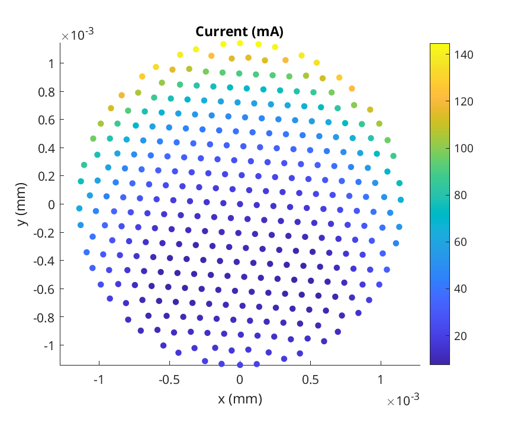
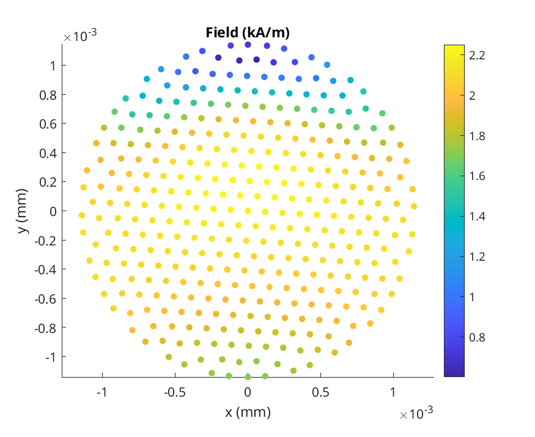
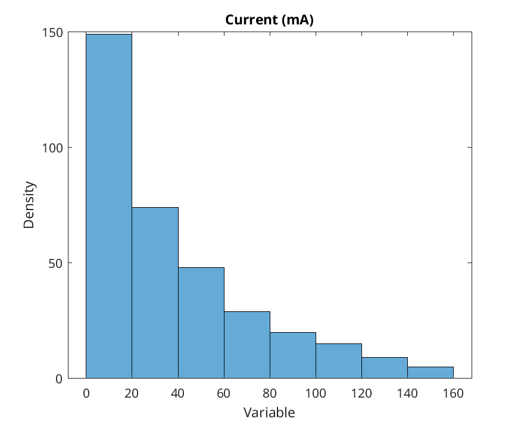

# Litz Wire Losses with Custom Twisting

This **MATLAB** tool extracts the **losses of a litz wire winding** with **custom twisting**.
A **2.5D method** is used to simulate the impact of the **twisting imperfection** on the **losses**.

The code is a simplified version of the method used in the **following paper**:
* T. Guillod, J. Huber, F. Krismer, and J. W. Kolar
* Litz wire losses: Effects of twisting imperfections
* IEEE COMPEL 2017, Stanford, CA, USA
* https://doi.org/10.1109/COMPEL.2017.8013327.

The following **method** is used to compute the **losses**:
* the geometry of the wire is given (coordinates of the strands)
* the twisting is defined with a permutation matrix (twisting of the strands)
* the DC inductance and DC resistance matrices are extracted (analytical solution)
* the permutation matrix is applied to the impedance matrix (twisting of the strands)
* the current sharing problem between the strands is solved (parallel connected strands)
* the magnetic field is computed for the different strands (internal and external field)
* the losses of the different strands is computed (analytical solution with Bessel functions)
 
The following **approximations** are made:
* The DC inductance and DC resistance matrices are used (and not the AC matrices)
* The current and field distribution inside the strands is assumed to be constant

## Examples

The following examples are included:
* [run_straight.m](run_straight.m) - Simulation of a Litz wire with untwisted strands
* [run_twisted.m](run_twisted.m) - Simulation of a Litz wire with fully twisted strands
* [run_random.m](run_random.m) - Simulation of a Litz wire with random twisting

### Gallery

    
    
    

## Compatibility

The tool is tested with the following MATLAB setup:
* Tested with MATLAB R2018b / 2019a / 2024b
* No toolboxes are required.
* Compatibility with GNU Octave not tested but probably easy to achieve.

## References

References for the litz wire losses:
* Guillod, T. / Litz Wire Losses: Effects of Twisting Imperfections / 2017
* Muehlethaler, J. / Modeling and Multi-Objective Optimization of Inductive Power Components / 2012
* Ferreira, J. / Electromagnetic Modelling of Power Electronic Converters / 1989

## Author

* **Thomas Guillod, ETH Zurich, Dartmouth College** - [GitHub Profile](https://github.com/otvam)

## License

* This project is licensed under the **BSD License**, see [LICENSE.md](LICENSE.md).
* This project is copyrighted by: (c) 2016-2020, ETH Zurich, Power Electronic Systems Laboratory, T. Guillod.
* This project is copyrighted by: (c) 2025-2025, Dartmouth College, Thayer School of Engineering, T. Guillod.
